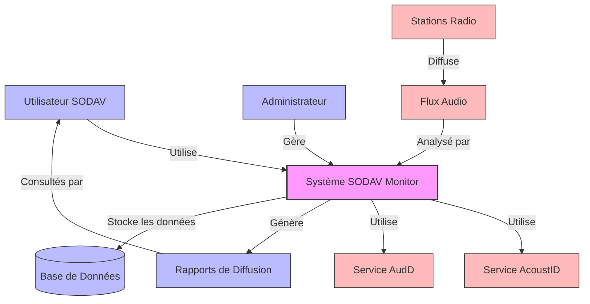

# Diagramme de Contexte - SODAV Monitor

Ce diagramme représente le niveau 1 du C4 Model (Contexte) pour le système SODAV Monitor. Il montre comment le système s'intègre dans son environnement, avec les utilisateurs et les systèmes externes avec lesquels il interagit.

## Diagramme

## Description des Éléments

### Utilisateurs

- **Utilisateur SODAV** - Personnel de la SODAV qui consulte les rapports de diffusion et les statistiques.
- **Administrateur** - Responsable de la configuration et de la maintenance du système.

### Systèmes

- **Système SODAV Monitor** - Le système principal qui surveille les flux audio, détecte les morceaux de musique et génère des rapports.
- **Base de Données** - Stocke toutes les données du système, y compris les détections, les métadonnées des pistes et les statistiques.

### Systèmes Externes

- **Stations Radio** - Les stations de radio et de télévision sénégalaises dont les flux sont surveillés.
- **Flux Audio** - Les flux audio en direct provenant des stations radio.
- **Service AcoustID** - Service externe utilisé pour la reconnaissance musicale basée sur les empreintes acoustiques.
- **Service AudD** - Service externe utilisé comme solution de secours pour la reconnaissance musicale.

### Flux de Données

- Les **Stations Radio** diffusent des **Flux Audio**.
- Le **Système SODAV Monitor** analyse ces flux audio.
- Le système utilise les services **AcoustID** et **AudD** pour identifier les morceaux de musique.
- Le système stocke les données dans la **Base de Données**.
- Le système génère des **Rapports de Diffusion** qui sont consultés par les **Utilisateurs SODAV**.
- Les **Administrateurs** gèrent et configurent le système.

## Objectifs Clés

1. **Surveillance en temps réel** - Surveiller en continu les flux audio des stations radio sénégalaises.
2. **Détection précise** - Identifier avec précision les morceaux de musique diffusés.
3. **Génération de rapports** - Produire des rapports détaillés sur les diffusions pour améliorer la distribution des droits d'auteur.
4. **Évolutivité** - Permettre l'ajout facile de nouvelles stations et l'adaptation à l'augmentation du volume de données.
5. **Fiabilité** - Assurer un fonctionnement continu et fiable du système.

## Contraintes

1. **Connectivité Internet** - Le système dépend d'une connexion Internet stable pour accéder aux flux audio et aux services externes.
2. **Qualité des flux** - La précision de la détection dépend de la qualité des flux audio.
3. **Limites des API** - Les services externes (AcoustID, AudD) ont des limites d'utilisation de leurs API.
4. **Spécificités de la musique africaine** - Certains morceaux de musique africaine peuvent être difficiles à identifier avec les services standard. 