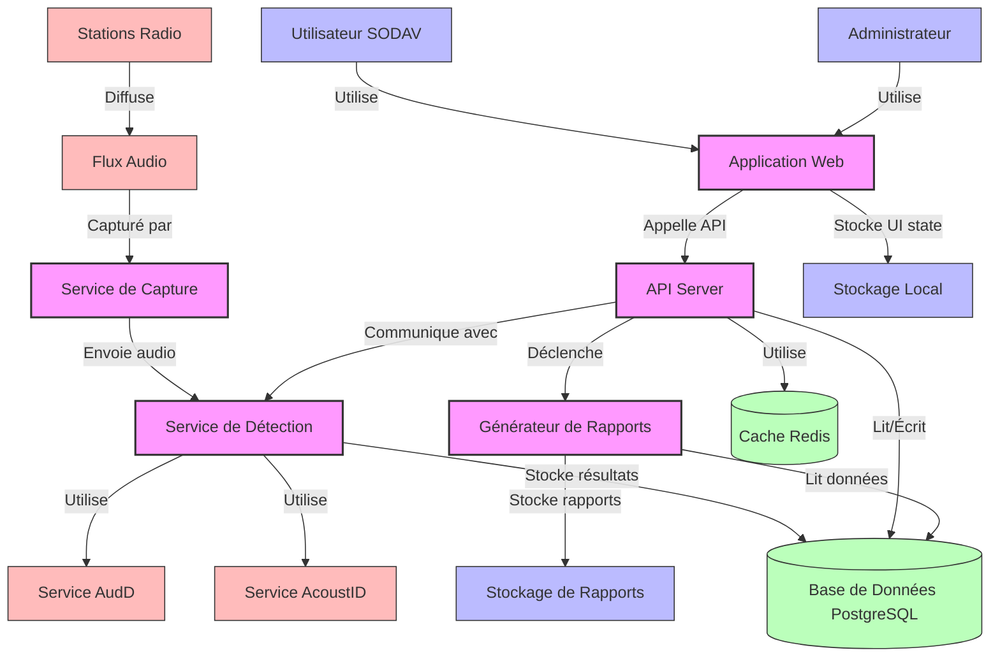

# Diagramme de Conteneurs - SODAV Monitor

Ce diagramme représente le niveau 2 du C4 Model (Conteneurs) pour le système SODAV Monitor. Il décompose le système en conteneurs de haut niveau (applications, bases de données, interfaces utilisateur, etc.) et montre leurs interactions.

## Diagramme

## Description des Conteneurs

### Interface Utilisateur

- **Application Web** - Interface utilisateur React/TypeScript avec Chakra UI, permettant aux utilisateurs et administrateurs d'interagir avec le système.

### Backend

- **API Server** - Serveur FastAPI qui expose les endpoints REST pour l'application web et gère la logique métier.
- **Service de Capture** - Service qui capture et traite les flux audio des stations radio.
- **Service de Détection** - Service qui analyse les flux audio et identifie les morceaux de musique.
- **Générateur de Rapports** - Service qui génère des rapports de diffusion basés sur les données de détection.

### Stockage de Données

- **Base de Données PostgreSQL** - Stocke toutes les données du système, y compris les métadonnées des pistes, les détections et les statistiques.
- **Cache Redis** - Stocke les données temporaires et les résultats de requêtes fréquentes pour améliorer les performances.
- **Stockage de Rapports** - Système de fichiers ou service de stockage pour les rapports générés.
- **Stockage Local** - Stockage côté client pour l'état de l'interface utilisateur.

### Services Externes

- **Service AcoustID** - Service externe utilisé pour la reconnaissance musicale basée sur les empreintes acoustiques.
- **Service AudD** - Service externe utilisé comme solution de secours pour la reconnaissance musicale.

## Interactions Principales

1. Les **Utilisateurs** et **Administrateurs** interagissent avec l'**Application Web**.
2. L'**Application Web** communique avec l'**API Server** pour récupérer et envoyer des données.
3. Le **Service de Capture** capture les **Flux Audio** des **Stations Radio**.
4. Le **Service de Détection** analyse les flux audio et utilise les services **AcoustID** et **AudD** pour identifier les morceaux.
5. Le **Service de Détection** stocke les résultats dans la **Base de Données PostgreSQL**.
6. L'**API Server** lit et écrit des données dans la **Base de Données PostgreSQL**.
7. L'**API Server** déclenche le **Générateur de Rapports** pour créer des rapports.
8. Le **Générateur de Rapports** lit les données de la **Base de Données PostgreSQL** et stocke les rapports dans le **Stockage de Rapports**.

## Technologies Utilisées

- **Frontend** : React, TypeScript, Chakra UI
- **Backend** : Python, FastAPI
- **Base de données** : PostgreSQL, Redis
- **Conteneurisation** : Docker
- **Détection Audio** : Chromaprint, AcoustID API, AudD API

## Considérations de Déploiement

- Tous les conteneurs peuvent être déployés sur une seule machine pour les environnements de développement et de test.
- Pour la production, les conteneurs peuvent être déployés sur plusieurs machines ou dans un environnement cloud pour améliorer la scalabilité et la résilience.
- Les services de capture et de détection peuvent être répliqués pour gérer plusieurs stations simultanément.
- Redis peut être configuré en cluster pour améliorer les performances et la disponibilité.
