# Diagramme de Composants - Backend SODAV Monitor

Ce diagramme représente le niveau 3 du C4 Model (Composants) pour le backend du système SODAV Monitor. Il décompose le conteneur "API Server" en composants et montre leurs interactions.

## Diagramme

```mermaid
graph TD
    APIGateway[API Gateway] -->|Route les requêtes| AuthController[Contrôleur d'Authentification]
    APIGateway -->|Route les requêtes| StationController[Contrôleur de Stations]
    APIGateway -->|Route les requêtes| TrackController[Contrôleur de Pistes]
    APIGateway -->|Route les requêtes| DetectionController[Contrôleur de Détection]
    APIGateway -->|Route les requêtes| ReportController[Contrôleur de Rapports]
    APIGateway -->|Route les requêtes| AnalyticsController[Contrôleur d'Analytique]
    
    AuthController -->|Utilise| AuthService[Service d'Authentification]
    AuthService -->|Gère| UserRepository[Dépôt d'Utilisateurs]
    
    StationController -->|Utilise| StationService[Service de Stations]
    StationService -->|Gère| StationRepository[Dépôt de Stations]
    StationService -->|Utilise| StationHealthService[Service de Santé des Stations]
    
    TrackController -->|Utilise| TrackService[Service de Pistes]
    TrackService -->|Gère| TrackRepository[Dépôt de Pistes]
    TrackService -->|Utilise| ArtistService[Service d'Artistes]
    ArtistService -->|Gère| ArtistRepository[Dépôt d'Artistes]
    
    DetectionController -->|Utilise| DetectionService[Service de Détection]
    DetectionService -->|Gère| DetectionRepository[Dépôt de Détections]
    DetectionService -->|Utilise| TrackService
    DetectionService -->|Utilise| ExternalServiceHandler[Gestionnaire de Services Externes]
    ExternalServiceHandler -->|Intègre| AcoustIDAdapter[Adaptateur AcoustID]
    ExternalServiceHandler -->|Intègre| AudDAdapter[Adaptateur AudD]
    
    ReportController -->|Utilise| ReportService[Service de Rapports]
    ReportService -->|Gère| ReportRepository[Dépôt de Rapports]
    ReportService -->|Utilise| ReportGenerator[Générateur de Rapports]
    ReportGenerator -->|Utilise| TemplateEngine[Moteur de Templates]
    ReportGenerator -->|Utilise| DataExporter[Exportateur de Données]
    
    AnalyticsController -->|Utilise| AnalyticsService[Service d'Analytique]
    AnalyticsService -->|Gère| AnalyticsRepository[Dépôt d'Analytique]
    AnalyticsService -->|Utilise| StatisticsCalculator[Calculateur de Statistiques]
    
    UserRepository -->|Accède| Database[(Base de Données)]
    StationRepository -->|Accède| Database
    TrackRepository -->|Accède| Database
    ArtistRepository -->|Accède| Database
    DetectionRepository -->|Accède| Database
    ReportRepository -->|Accède| Database
    AnalyticsRepository -->|Accède| Database
    
    AnalyticsService -->|Utilise| CacheService[Service de Cache]
    CacheService -->|Accède| Redis[(Cache Redis)]
    
    classDef controller fill:#f9f,stroke:#333,stroke-width:2px;
    classDef service fill:#bbf,stroke:#333,stroke-width:1px;
    classDef repository fill:#bfb,stroke:#333,stroke-width:1px;
    classDef adapter fill:#fbb,stroke:#333,stroke-width:1px;
    classDef database fill:#ddd,stroke:#333,stroke-width:1px;
    
    class APIGateway,AuthController,StationController,TrackController,DetectionController,ReportController,AnalyticsController controller;
    class AuthService,StationService,TrackService,ArtistService,DetectionService,ReportService,AnalyticsService,StationHealthService,ExternalServiceHandler,ReportGenerator,TemplateEngine,DataExporter,StatisticsCalculator,CacheService service;
    class UserRepository,StationRepository,TrackRepository,ArtistRepository,DetectionRepository,ReportRepository,AnalyticsRepository repository;
    class AcoustIDAdapter,AudDAdapter adapter;
    class Database,Redis database;
```

## Description des Composants

### Contrôleurs

- **API Gateway** - Point d'entrée pour toutes les requêtes API, gère le routage et la validation des requêtes.
- **Contrôleur d'Authentification** - Gère l'authentification et l'autorisation des utilisateurs.
- **Contrôleur de Stations** - Gère les opérations CRUD pour les stations radio.
- **Contrôleur de Pistes** - Gère les opérations CRUD pour les pistes musicales.
- **Contrôleur de Détection** - Gère les opérations liées à la détection musicale.
- **Contrôleur de Rapports** - Gère la génération et la distribution des rapports.
- **Contrôleur d'Analytique** - Gère les requêtes d'analytique et de statistiques.

### Services

- **Service d'Authentification** - Implémente la logique d'authentification et de gestion des utilisateurs.
- **Service de Stations** - Implémente la logique de gestion des stations radio.
- **Service de Santé des Stations** - Surveille l'état des stations radio.
- **Service de Pistes** - Implémente la logique de gestion des pistes musicales.
- **Service d'Artistes** - Implémente la logique de gestion des artistes.
- **Service de Détection** - Implémente la logique de détection musicale.
- **Gestionnaire de Services Externes** - Gère les interactions avec les services externes de détection.
- **Service de Rapports** - Implémente la logique de génération et de distribution des rapports.
- **Générateur de Rapports** - Génère les rapports dans différents formats.
- **Moteur de Templates** - Gère les templates pour les rapports.
- **Exportateur de Données** - Exporte les données dans différents formats (PDF, XLSX, CSV).
- **Service d'Analytique** - Implémente la logique d'analytique et de statistiques.
- **Calculateur de Statistiques** - Calcule les statistiques à partir des données de détection.
- **Service de Cache** - Gère le cache pour améliorer les performances.

### Dépôts

- **Dépôt d'Utilisateurs** - Gère l'accès aux données des utilisateurs.
- **Dépôt de Stations** - Gère l'accès aux données des stations radio.
- **Dépôt de Pistes** - Gère l'accès aux données des pistes musicales.
- **Dépôt d'Artistes** - Gère l'accès aux données des artistes.
- **Dépôt de Détections** - Gère l'accès aux données des détections.
- **Dépôt de Rapports** - Gère l'accès aux données des rapports.
- **Dépôt d'Analytique** - Gère l'accès aux données d'analytique.

### Adaptateurs

- **Adaptateur AcoustID** - Adapte l'API AcoustID pour l'utilisation dans le système.
- **Adaptateur AudD** - Adapte l'API AudD pour l'utilisation dans le système.

### Stockage de Données

- **Base de Données** - PostgreSQL, stocke toutes les données du système.
- **Cache Redis** - Stocke les données temporaires et les résultats de requêtes fréquentes.

## Interactions Principales

1. Les requêtes API sont reçues par l'**API Gateway** qui les route vers le contrôleur approprié.
2. Les contrôleurs utilisent les services pour implémenter la logique métier.
3. Les services utilisent les dépôts pour accéder aux données.
4. Les dépôts accèdent à la **Base de Données** pour lire et écrire des données.
5. Le **Service de Détection** utilise le **Gestionnaire de Services Externes** pour interagir avec les services externes de détection.
6. Le **Service d'Analytique** utilise le **Service de Cache** pour améliorer les performances des requêtes fréquentes.

## Considérations Techniques

- **Architecture Hexagonale** - Le backend suit une architecture hexagonale (ports et adaptateurs) pour séparer la logique métier des détails d'implémentation.
- **Injection de Dépendances** - Les dépendances sont injectées pour faciliter les tests et la maintenance.
- **Gestion des Erreurs** - Chaque composant gère ses propres erreurs et les propage de manière appropriée.
- **Logging** - Chaque composant utilise un système de logging pour faciliter le débogage et la surveillance.
- **Transactions** - Les opérations qui modifient plusieurs entités sont exécutées dans des transactions pour garantir la cohérence des données. 