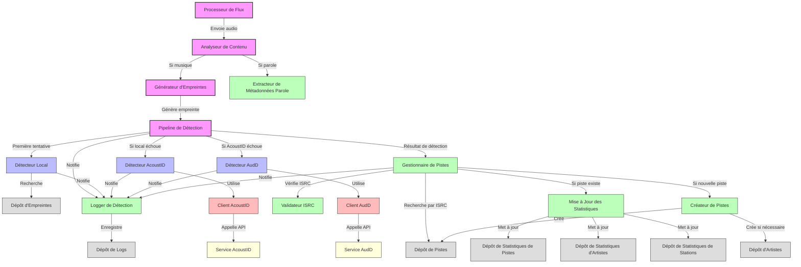

# Diagramme de Composants - Service de Détection SODAV Monitor

Ce diagramme représente le niveau 3 du C4 Model (Composants) pour le service de détection du système SODAV Monitor. Il décompose le conteneur "Service de Détection" en composants et montre leurs interactions.

## Diagramme

## Description des Composants

### Processeurs

- **Processeur de Flux** - Capture et traite les flux audio des stations radio.
- **Analyseur de Contenu** - Analyse le contenu audio pour déterminer s'il s'agit de musique ou de parole.
- **Générateur d'Empreintes** - Génère des empreintes digitales à partir des segments audio identifiés comme de la musique.
- **Pipeline de Détection** - Coordonne le processus de détection en utilisant différentes méthodes dans un ordre spécifique.

### Détecteurs

- **Détecteur Local** - Recherche des correspondances dans la base de données locale à l'aide des empreintes digitales.
- **Détecteur AcoustID** - Utilise le service AcoustID pour identifier les morceaux de musique.
- **Détecteur AudD** - Utilise le service AudD comme solution de secours pour l'identification.

### Gestionnaires

- **Gestionnaire de Pistes** - Gère les pistes musicales, vérifie l'existence des pistes et coordonne la création ou la mise à jour.
- **Validateur ISRC** - Valide les codes ISRC et assure leur unicité.
- **Créateur de Pistes** - Crée de nouvelles pistes et artistes dans la base de données.
- **Mise à Jour des Statistiques** - Met à jour les statistiques de lecture pour les pistes, artistes et stations.
- **Extracteur de Métadonnées Parole** - Extrait les métadonnées des segments identifiés comme de la parole.
- **Logger de Détection** - Enregistre les événements de détection pour le débogage et l'analyse.

### Clients

- **Client AcoustID** - Client pour l'API AcoustID.
- **Client AudD** - Client pour l'API AudD.

### Dépôts

- **Dépôt d'Empreintes** - Stocke et récupère les empreintes digitales.
- **Dépôt de Pistes** - Stocke et récupère les informations sur les pistes.
- **Dépôt d'Artistes** - Stocke et récupère les informations sur les artistes.
- **Dépôt de Statistiques de Pistes** - Stocke et récupère les statistiques de lecture des pistes.
- **Dépôt de Statistiques d'Artistes** - Stocke et récupère les statistiques de lecture des artistes.
- **Dépôt de Statistiques de Stations** - Stocke et récupère les statistiques de lecture des stations.
- **Dépôt de Logs** - Stocke les logs de détection.

### Services Externes

- **Service AcoustID** - Service externe pour la reconnaissance musicale basée sur les empreintes acoustiques.
- **Service AudD** - Service externe pour la reconnaissance musicale.

## Flux de Détection

1. Le **Processeur de Flux** capture et traite les flux audio des stations radio.
2. L'**Analyseur de Contenu** détermine si le contenu est de la musique ou de la parole.
3. Si c'est de la musique, le **Générateur d'Empreintes** génère une empreinte digitale.
4. Le **Pipeline de Détection** coordonne le processus de détection:
   a. Le **Détecteur Local** recherche d'abord des correspondances dans la base de données locale.
   b. Si aucune correspondance n'est trouvée, le **Détecteur AcoustID** est utilisé.
   c. Si AcoustID échoue, le **Détecteur AudD** est utilisé comme solution de secours.
5. Le résultat de la détection est envoyé au **Gestionnaire de Pistes**.
6. Le **Gestionnaire de Pistes** vérifie si la piste existe déjà en utilisant le code ISRC.
7. Si la piste existe, la **Mise à Jour des Statistiques** met à jour les statistiques de lecture.
8. Si la piste n'existe pas, le **Créateur de Pistes** crée une nouvelle piste et, si nécessaire, un nouvel artiste.
9. Le **Logger de Détection** enregistre tous les événements de détection.

## Optimisations pour la Contrainte d'Unicité ISRC

Le système utilise une contrainte d'unicité sur les codes ISRC pour éviter les doublons de pistes dans la base de données. Les composants suivants sont impliqués dans cette optimisation:

1. **Validateur ISRC** - Valide les codes ISRC et assure leur conformité au format standard.
2. **Gestionnaire de Pistes** - Vérifie l'existence des pistes par ISRC avant de créer de nouvelles pistes.
3. **TrackRepository** - Implémente la contrainte d'unicité au niveau de la base de données.

## Considérations Techniques

- **Traitement Asynchrone** - Le traitement des flux audio est effectué de manière asynchrone pour permettre le traitement simultané de plusieurs stations.
- **Mise en Cache** - Les résultats de détection récents sont mis en cache pour améliorer les performances.
- **Gestion des Erreurs** - Chaque composant gère ses propres erreurs et les propage de manière appropriée.
- **Logging** - Tous les événements de détection sont enregistrés pour faciliter le débogage et l'analyse.
- **Métriques de Performance** - Des métriques sont collectées pour surveiller les performances du système de détection.
