# Diagramme de Composants - Frontend SODAV Monitor

Ce diagramme représente le niveau 3 du C4 Model (Composants) pour le frontend du système SODAV Monitor. Il décompose le conteneur "Application Web" en composants et montre leurs interactions.

## Diagramme

```mermaid
graph TD
    Router[Router] -->|Route vers| AuthModule[Module d'Authentification]
    Router -->|Route vers| DashboardModule[Module de Tableau de Bord]
    Router -->|Route vers| StationsModule[Module de Stations]
    Router -->|Route vers| TracksModule[Module de Pistes]
    Router -->|Route vers| DetectionModule[Module de Détection]
    Router -->|Route vers| ReportsModule[Module de Rapports]
    Router -->|Route vers| AnalyticsModule[Module d'Analytique]
    Router -->|Route vers| SettingsModule[Module de Paramètres]
    
    AuthModule -->|Utilise| AuthService[Service d'Authentification]
    AuthService -->|Appelle API| APIClient[Client API]
    
    DashboardModule -->|Utilise| DashboardService[Service de Tableau de Bord]
    DashboardService -->|Appelle API| APIClient
    DashboardModule -->|Utilise| ChartComponent[Composant de Graphiques]
    DashboardModule -->|Utilise| StatCardComponent[Composant de Carte Statistique]
    
    StationsModule -->|Utilise| StationsService[Service de Stations]
    StationsService -->|Appelle API| APIClient
    StationsModule -->|Utilise| StationListComponent[Composant de Liste de Stations]
    StationsModule -->|Utilise| StationDetailComponent[Composant de Détail de Station]
    StationsModule -->|Utilise| StationFormComponent[Composant de Formulaire de Station]
    
    TracksModule -->|Utilise| TracksService[Service de Pistes]
    TracksService -->|Appelle API| APIClient
    TracksModule -->|Utilise| TrackListComponent[Composant de Liste de Pistes]
    TracksModule -->|Utilise| TrackDetailComponent[Composant de Détail de Piste]
    TracksModule -->|Utilise| TrackSearchComponent[Composant de Recherche de Pistes]
    
    DetectionModule -->|Utilise| DetectionService[Service de Détection]
    DetectionService -->|Appelle API| APIClient
    DetectionModule -->|Utilise| LiveDetectionComponent[Composant de Détection en Direct]
    DetectionModule -->|Utilise| DetectionHistoryComponent[Composant d'Historique de Détection]
    DetectionModule -->|Utilise| AudioUploadComponent[Composant d'Upload Audio]
    
    ReportsModule -->|Utilise| ReportsService[Service de Rapports]
    ReportsService -->|Appelle API| APIClient
    ReportsModule -->|Utilise| ReportListComponent[Composant de Liste de Rapports]
    ReportsModule -->|Utilise| ReportGeneratorComponent[Composant de Générateur de Rapports]
    ReportsModule -->|Utilise| SubscriptionComponent[Composant d'Abonnement]
    
    AnalyticsModule -->|Utilise| AnalyticsService[Service d'Analytique]
    AnalyticsService -->|Appelle API| APIClient
    AnalyticsModule -->|Utilise| AnalyticsDashboardComponent[Composant de Tableau de Bord d'Analytique]
    AnalyticsModule -->|Utilise| TrendsComponent[Composant de Tendances]
    AnalyticsModule -->|Utilise| ComparisonComponent[Composant de Comparaison]
    
    SettingsModule -->|Utilise| SettingsService[Service de Paramètres]
    SettingsService -->|Appelle API| APIClient
    SettingsModule -->|Utilise| UserSettingsComponent[Composant de Paramètres Utilisateur]
    SettingsModule -->|Utilise| SystemSettingsComponent[Composant de Paramètres Système]
    
    APIClient -->|Communique avec| APIServer[API Server]
    
    ThemeProvider[Fournisseur de Thème] -->|Applique thème à| AuthModule
    ThemeProvider -->|Applique thème à| DashboardModule
    ThemeProvider -->|Applique thème à| StationsModule
    ThemeProvider -->|Applique thème à| TracksModule
    ThemeProvider -->|Applique thème à| DetectionModule
    ThemeProvider -->|Applique thème à| ReportsModule
    ThemeProvider -->|Applique thème à| AnalyticsModule
    ThemeProvider -->|Applique thème à| SettingsModule
    
    AuthContext[Contexte d'Authentification] -->|Fournit état auth à| Router
    AuthContext -->|Fournit état auth à| APIClient
    
    NotificationSystem[Système de Notifications] -->|Affiche notifications à| AuthModule
    NotificationSystem -->|Affiche notifications à| DashboardModule
    NotificationSystem -->|Affiche notifications à| StationsModule
    NotificationSystem -->|Affiche notifications à| TracksModule
    NotificationSystem -->|Affiche notifications à| DetectionModule
    NotificationSystem -->|Affiche notifications à| ReportsModule
    NotificationSystem -->|Affiche notifications à| AnalyticsModule
    NotificationSystem -->|Affiche notifications à| SettingsModule
    
    classDef module fill:#f9f,stroke:#333,stroke-width:2px;
    classDef service fill:#bbf,stroke:#333,stroke-width:1px;
    classDef component fill:#bfb,stroke:#333,stroke-width:1px;
    classDef context fill:#fbb,stroke:#333,stroke-width:1px;
    classDef external fill:#ddd,stroke:#333,stroke-width:1px;
    
    class Router,AuthModule,DashboardModule,StationsModule,TracksModule,DetectionModule,ReportsModule,AnalyticsModule,SettingsModule module;
    class AuthService,DashboardService,StationsService,TracksService,DetectionService,ReportsService,AnalyticsService,SettingsService,APIClient service;
    class ChartComponent,StatCardComponent,StationListComponent,StationDetailComponent,StationFormComponent,TrackListComponent,TrackDetailComponent,TrackSearchComponent,LiveDetectionComponent,DetectionHistoryComponent,AudioUploadComponent,ReportListComponent,ReportGeneratorComponent,SubscriptionComponent,AnalyticsDashboardComponent,TrendsComponent,ComparisonComponent,UserSettingsComponent,SystemSettingsComponent component;
    class ThemeProvider,AuthContext,NotificationSystem context;
    class APIServer external;
```

## Description des Composants

### Modules

- **Router** - Gère le routage de l'application et la navigation entre les différentes vues.
- **Module d'Authentification** - Gère l'authentification et l'autorisation des utilisateurs.
- **Module de Tableau de Bord** - Affiche une vue d'ensemble des statistiques et des informations importantes.
- **Module de Stations** - Gère les stations radio et leurs informations.
- **Module de Pistes** - Gère les pistes musicales et leurs métadonnées.
- **Module de Détection** - Gère la détection musicale en direct et l'historique des détections.
- **Module de Rapports** - Gère la génération et la consultation des rapports.
- **Module d'Analytique** - Fournit des analyses détaillées et des visualisations des données.
- **Module de Paramètres** - Permet de configurer les paramètres de l'application.

### Services

- **Service d'Authentification** - Gère les opérations d'authentification et de gestion des utilisateurs.
- **Service de Tableau de Bord** - Récupère les données pour le tableau de bord.
- **Service de Stations** - Gère les opérations CRUD pour les stations radio.
- **Service de Pistes** - Gère les opérations CRUD pour les pistes musicales.
- **Service de Détection** - Gère les opérations liées à la détection musicale.
- **Service de Rapports** - Gère les opérations liées aux rapports.
- **Service d'Analytique** - Gère les opérations liées à l'analytique.
- **Service de Paramètres** - Gère les opérations liées aux paramètres.
- **Client API** - Gère les communications avec l'API backend.

### Composants

- **Composant de Graphiques** - Affiche des graphiques et des visualisations.
- **Composant de Carte Statistique** - Affiche des statistiques sous forme de cartes.
- **Composant de Liste de Stations** - Affiche une liste de stations radio.
- **Composant de Détail de Station** - Affiche les détails d'une station radio.
- **Composant de Formulaire de Station** - Permet de créer ou de modifier une station radio.
- **Composant de Liste de Pistes** - Affiche une liste de pistes musicales.
- **Composant de Détail de Piste** - Affiche les détails d'une piste musicale.
- **Composant de Recherche de Pistes** - Permet de rechercher des pistes musicales.
- **Composant de Détection en Direct** - Affiche les détections en temps réel.
- **Composant d'Historique de Détection** - Affiche l'historique des détections.
- **Composant d'Upload Audio** - Permet d'uploader des fichiers audio pour la détection.
- **Composant de Liste de Rapports** - Affiche une liste de rapports.
- **Composant de Générateur de Rapports** - Permet de générer des rapports.
- **Composant d'Abonnement** - Permet de gérer les abonnements aux rapports.
- **Composant de Tableau de Bord d'Analytique** - Affiche un tableau de bord d'analytique.
- **Composant de Tendances** - Affiche les tendances des données.
- **Composant de Comparaison** - Permet de comparer des données.
- **Composant de Paramètres Utilisateur** - Permet de configurer les paramètres utilisateur.
- **Composant de Paramètres Système** - Permet de configurer les paramètres système.

### Contextes et Fournisseurs

- **Fournisseur de Thème** - Fournit le thème de l'application (utilisant Chakra UI).
- **Contexte d'Authentification** - Gère l'état d'authentification global.
- **Système de Notifications** - Gère les notifications système.

### Systèmes Externes

- **API Server** - Serveur API backend avec lequel le frontend communique.

## Interactions Principales

1. Le **Router** gère la navigation entre les différents modules de l'application.
2. Chaque module utilise des services pour récupérer et manipuler des données.
3. Les services utilisent le **Client API** pour communiquer avec l'**API Server**.
4. Le **Contexte d'Authentification** fournit l'état d'authentification à tous les composants qui en ont besoin.
5. Le **Fournisseur de Thème** applique le thème Chakra UI à tous les composants.
6. Le **Système de Notifications** affiche des notifications à l'utilisateur en fonction des actions et des événements.

## Considérations Techniques

- **Architecture Modulaire** - L'application est organisée en modules fonctionnels pour faciliter la maintenance et l'évolutivité.
- **Gestion d'État** - L'état global est géré à l'aide de contextes React et de hooks personnalisés.
- **Composants Réutilisables** - Les composants sont conçus pour être réutilisables dans différentes parties de l'application.
- **Responsive Design** - L'interface utilisateur est conçue pour s'adapter à différentes tailles d'écran.
- **Accessibilité** - Les composants sont conçus pour être accessibles conformément aux normes WCAG.
- **Internationalisation** - L'application prend en charge plusieurs langues.
- **Thème Personnalisable** - L'application utilise Chakra UI pour permettre la personnalisation du thème.
- **Optimisation des Performances** - Les composants sont optimisés pour minimiser les rendus inutiles. 