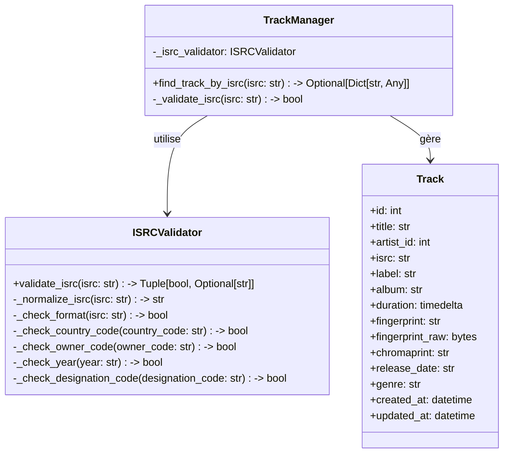

# Diagramme de Code - Validateur ISRC

Ce diagramme représente le niveau 4 du C4 Model (Code) pour le validateur ISRC du système SODAV Monitor. Il montre l'implémentation détaillée du composant qui valide les codes ISRC.

## Diagramme de Classes



## Implémentation du Validateur ISRC

```python
def validate_isrc(isrc: str) -> Tuple[bool, Optional[str]]:
    """
    Valide et normalise un code ISRC.
    
    Format ISRC: CC-XXX-YY-NNNNN
    - CC: Code pays (2 lettres)
    - XXX: Code du propriétaire (3 caractères alphanumériques)
    - YY: Année de référence (2 chiffres)
    - NNNNN: Code de désignation (5 chiffres)
    
    Args:
        isrc: Code ISRC à valider.
        
    Returns:
        Tuple contenant:
        - Un booléen indiquant si l'ISRC est valide.
        - L'ISRC normalisé si valide, None sinon.
        
    Examples:
        >>> validate_isrc("FR-Z03-14-00123")
        (True, "FRZ0314000123")
        >>> validate_isrc("XX-123-45-6789")
        (False, None)
    """
    if not isrc:
        return False, None
    
    # Normaliser l'ISRC en supprimant les tirets et les espaces
    normalized_isrc = _normalize_isrc(isrc)
    
    # Vérifier la longueur
    if len(normalized_isrc) != 12:
        return False, None
    
    # Extraire les composants
    country_code = normalized_isrc[0:2]
    owner_code = normalized_isrc[2:5]
    year = normalized_isrc[5:7]
    designation_code = normalized_isrc[7:12]
    
    # Vérifier chaque composant
    if not _check_country_code(country_code):
        return False, None
    
    if not _check_owner_code(owner_code):
        return False, None
    
    if not _check_year(year):
        return False, None
    
    if not _check_designation_code(designation_code):
        return False, None
    
    return True, normalized_isrc

def _normalize_isrc(isrc: str) -> str:
    """
    Normalise un code ISRC en supprimant les tirets et les espaces.
    
    Args:
        isrc: Code ISRC à normaliser.
        
    Returns:
        Code ISRC normalisé.
    """
    return isrc.replace("-", "").replace(" ", "").upper()

def _check_format(isrc: str) -> bool:
    """
    Vérifie si le format global de l'ISRC est valide.
    
    Args:
        isrc: Code ISRC à vérifier.
        
    Returns:
        True si le format est valide, False sinon.
    """
    pattern = r'^[A-Z]{2}[A-Z0-9]{3}[0-9]{7}$'
    return bool(re.match(pattern, isrc))

def _check_country_code(country_code: str) -> bool:
    """
    Vérifie si le code pays est valide.
    
    Args:
        country_code: Code pays à vérifier.
        
    Returns:
        True si le code pays est valide, False sinon.
    """
    return country_code.isalpha() and len(country_code) == 2

def _check_owner_code(owner_code: str) -> bool:
    """
    Vérifie si le code du propriétaire est valide.
    
    Args:
        owner_code: Code du propriétaire à vérifier.
        
    Returns:
        True si le code du propriétaire est valide, False sinon.
    """
    return len(owner_code) == 3 and all(c.isalnum() for c in owner_code)

def _check_year(year: str) -> bool:
    """
    Vérifie si l'année est valide.
    
    Args:
        year: Année à vérifier.
        
    Returns:
        True si l'année est valide, False sinon.
    """
    return year.isdigit() and len(year) == 2

def _check_designation_code(designation_code: str) -> bool:
    """
    Vérifie si le code de désignation est valide.
    
    Args:
        designation_code: Code de désignation à vérifier.
        
    Returns:
        True si le code de désignation est valide, False sinon.
    """
    return designation_code.isdigit() and len(designation_code) == 5
```

## Utilisation dans le Gestionnaire de Pistes

```python
class TrackManager:
    def __init__(self, db_session: Session):
        self.db_session = db_session
        self._isrc_validator = ISRCValidator()
    
    async def find_track_by_isrc(self, isrc: str) -> Optional[Dict[str, Any]]:
        """
        Recherche une piste par son code ISRC.
        
        Args:
            isrc: Code ISRC à rechercher.
            
        Returns:
            Dictionnaire contenant les informations de la piste si trouvée, None sinon.
        """
        if not self._validate_isrc(isrc):
            return None
        
        # Normaliser l'ISRC
        is_valid, normalized_isrc = self._isrc_validator.validate_isrc(isrc)
        if not is_valid:
            return None
        
        # Rechercher la piste dans la base de données
        track = self.db_session.query(Track).filter(Track.isrc == normalized_isrc).first()
        if not track:
            return None
        
        # Convertir la piste en dictionnaire
        return {
            "id": track.id,
            "title": track.title,
            "artist_id": track.artist_id,
            "isrc": track.isrc,
            "label": track.label,
            "album": track.album,
            "duration": track.duration,
            "fingerprint": track.fingerprint,
            "release_date": track.release_date,
            "genre": track.genre
        }
    
    def _validate_isrc(self, isrc: str) -> bool:
        """
        Valide un code ISRC.
        
        Args:
            isrc: Code ISRC à valider.
            
        Returns:
            True si l'ISRC est valide, False sinon.
        """
        if not isrc:
            return False
        
        is_valid, _ = self._isrc_validator.validate_isrc(isrc)
        return is_valid
```

## Contrainte d'Unicité dans la Base de Données

La contrainte d'unicité sur les codes ISRC est implémentée au niveau de la base de données dans le modèle `Track`:

```python
class Track(Base):
    """Track model."""
    __tablename__ = "tracks"

    id = Column(Integer, primary_key=True, index=True)
    title = Column(String, nullable=False)
    artist_id = Column(Integer, ForeignKey("artists.id"))
    isrc = Column(String(12), unique=True, index=True)  # Contrainte d'unicité
    # ... autres colonnes ...
```

Cette contrainte garantit qu'il ne peut pas y avoir deux pistes avec le même code ISRC dans la base de données.

## Tests Unitaires

```python
def test_validate_isrc():
    """Teste la fonction validate_isrc avec différents cas."""
    # Cas valides
    assert validate_isrc("FR-Z03-14-00123") == (True, "FRZ0314000123")
    assert validate_isrc("FRZ0314000123") == (True, "FRZ0314000123")
    assert validate_isrc("US-K2A-99-00001") == (True, "USK2A9900001")
    
    # Cas invalides
    assert validate_isrc("") == (False, None)
    assert validate_isrc(None) == (False, None)
    assert validate_isrc("XX-123-45-6789") == (False, None)  # Code pays invalide
    assert validate_isrc("FR-Z03-XX-00123") == (False, None)  # Année invalide
    assert validate_isrc("FR-Z03-14-0012") == (False, None)  # Code de désignation trop court
    assert validate_isrc("FR-Z0-14-00123") == (False, None)  # Code du propriétaire trop court
    assert validate_isrc("FRZ0314000123456") == (False, None)  # Trop long
```

## Considérations d'Implémentation

1. **Validation Stricte** - Le validateur ISRC effectue une validation stricte pour garantir que seuls les codes ISRC valides sont acceptés.
2. **Normalisation** - Les codes ISRC sont normalisés (suppression des tirets et des espaces, conversion en majuscules) pour garantir la cohérence.
3. **Contrainte d'Unicité** - La contrainte d'unicité au niveau de la base de données empêche la création de pistes avec des codes ISRC dupliqués.
4. **Recherche Efficace** - L'index sur la colonne ISRC permet une recherche efficace des pistes par ISRC.
5. **Documentation** - Le code est bien documenté avec des docstrings au format Google, des exemples et des tests unitaires.
6. **Gestion des Erreurs** - Le validateur gère correctement les cas d'erreur et retourne des valeurs appropriées. 